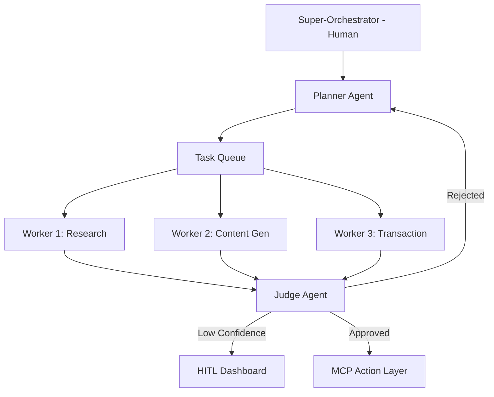

# **Project Chimera: Domain Architecture Strategy**

## **1. Executive Summary**
Project Chimera is an architectural pivot from static content automation to a network of **Autonomous Influencer Agents**. These agents are persistent, goal-directed entities capable of perception, reasoning, and **Agentic Commerce**—transacting independently via blockchain protocols.

## **2. Agent Coordination Pattern: FastRender Swarm**
We will implement the **FastRender Swarm** architecture to manage complex autonomous behaviours. This role-based hierarchy prevents the "monolithic agent" failure point and maximises throughput through parallelism.

*   **Planner (The Strategist):** Decomposes high-level marketing goals (e.g., "Grow Gen-Z engagement in Ethiopia") into a directed acyclic graph (DAG) of executable tasks.
*   **Worker (The Executor):** Ephemeral, stateless agents that perform atomic tasks (e.g., drafting a caption or generating an image) using **MCP Tools**.
*   **Judge (The Gatekeeper):** Validates Worker output against brand voice (SOUL.md) and ethical guardrails. It utilizes **Optimistic Concurrency Control (OCC)** to prevent state conflicts.

### **Swarm Interaction Diagram (Mermaid)**

## **3. Human-in-the-Loop (HITL) & Governance**
To ensure brand safety, we follow the **"Management by Exception"** principle. Human intervention is only required when the Judge identifies risks based on **Confidence Tiers**:
*   **Auto-Approve (>0.90):** Executed immediately.
*   **Async Approval (0.70 - 0.90):** Paused for human review in the Orchestrator Dashboard.
*   **Reject/Retry (<0.70):** Automatically sent back to the Planner for re-evaluation.
*   **Hard Filter:** Any content involving politics or legal advice is **manually routed** to HITL regardless of score.

## **4. Data Persistence Strategy**
We will use a hybrid approach to handle high-velocity video metadata and long-term agent memory:
*   **Transactional Data (SQL):** **PostgreSQL** will store user data, campaign configurations, and video metadata to ensure ACID compliance and structured relationships.
*   **Semantic Memory (Vector):** **Weaviate** will house agent "biographies" and past experiences, enabling **Retrieval-Augmented Generation (RAG)** for long-term persona consistency.
*   **Episodic Cache:** **Redis** for short-term task queuing and immediate state management.

## **5. OpenClaw & Social Protocols**
Project Chimera fits into the **OpenClaw Agent Social Network** as a service provider. 
*   **Discovery:** Agents will publish their "Availability" and "Specialisations" to the OpenClaw network.
*   **Agent-to-Agent Protocols:** Communication will be handled via **Agentic Commerce Protocols (ACP)** and the **Model Context Protocol (MCP)**, allowing our influencers to negotiate deals with other agents (e.g., a "Photographer Agent" selling an image to a "Chimera Influencer").

## **6. Economic Agency**
Every agent is endowed with a non-custodial **Coinbase AgentKit** wallet.
*   **CFO Judge:** A specialized Judge sub-agent that enforces daily spend limits (e.g., max $50 USDC) and prevents unauthorized financial transactions.

